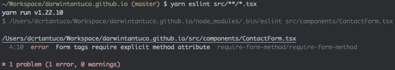

# eslint-plugin-require-form-method-post


Disallow form tags without method post

Prevents sensitive data appearing on URLs



## Installation

You'll first need to install [ESLint](http://eslint.org):

```
$ npm i eslint --save-dev
```

Next, install `eslint-plugin-require-form-method-post`:

### npm

```
$ npm install eslint-plugin-require-form-method-post --save-dev
```

### yarn

```
$ yarn add eslint-plugin-require-form-method-post --dev
```

## Usage

Add `require-form-method-post` to the plugins section of your `.eslintrc` configuration file. You can omit the `eslint-plugin-` prefix:

```json
{
  "plugins": ["require-form-method-post"]
}
```

Then configure the rules you want to use under the rules section.

```json
{
  "rules": {
    "require-form-method-post/require-form-method-post": "error"
  }
}
```
